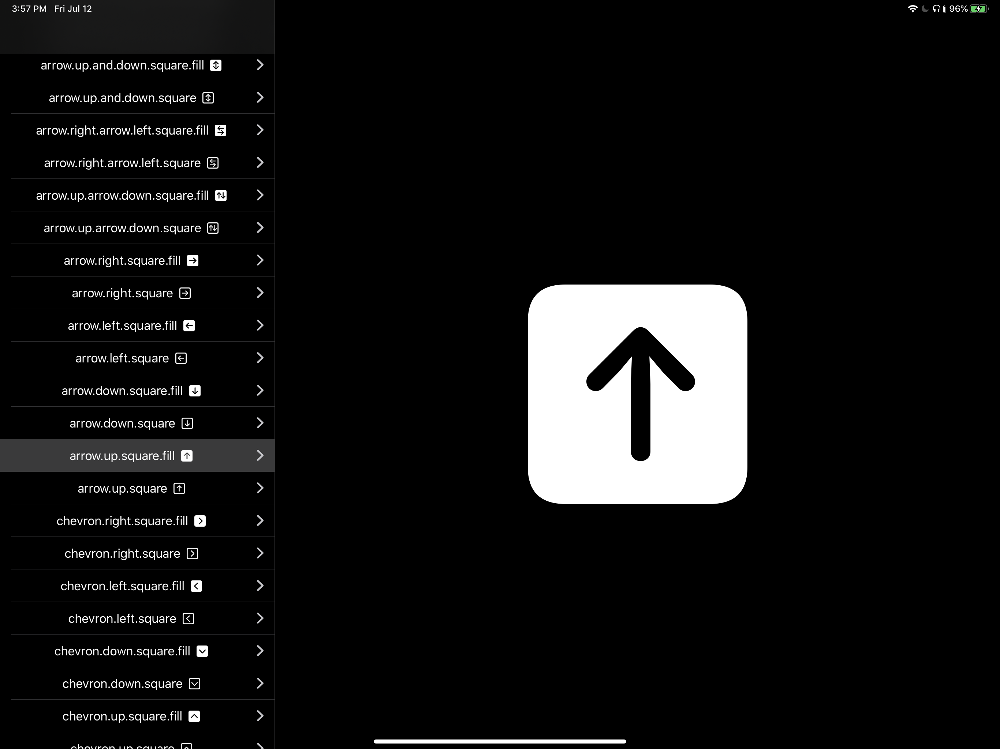

# SF

## SFExplorer

## List of SFSymbols in use

    // MARK: Circles
    case circle
    case circle_fill
    case circle_lefthalf_fill
    case circle_righthalf_fill
    // MARK: ABC Circles
    case a_circle
    case a_circle_fill
    case b_circle
    case b_circle_fill
    case c_circle
    case c_circle_fill
    case d_circle
    case d_circle_fill
    case e_circle
    case e_circle_fill
    case f_circle
    case f_circle_fill
    case g_circle
    case g_circle_fill
    case h_circle
    case h_circle_fill
    case i_circle
    case i_circle_fill
    case j_circle
    case j_circle_fill
    case k_circle
    case k_circle_fill
    case l_circle
    case l_circle_fill
    case m_circle
    case m_circle_fill
    case n_circle
    case n_circle_fill
    case o_circle
    case o_circle_fill
    case p_circle
    case p_circle_fill
    case q_circle
    case q_circle_fill
    case r_circle
    case r_circle_fill
    case s_circle
    case s_circle_fill
    case t_circle
    case t_circle_fill
    case u_circle
    case u_circle_fill
    case v_circle
    case v_circle_fill
    case w_circle
    case w_circle_fill
    case x_circle
    case x_circle_fill
    case y_circle
    case y_circle_fill
    case z_circle
    case z_circle_fill
    // MARK: Currency Circles
    case dollarsign_circle
    case dollarsign_circle_fill
    case centsign_circle
    case centsign_circle_fill
    case yensign_circle
    case yensign_circle_fill
    case sterlingsign_circle
    case sterlingsign_circle_fill
    case francsign_circle
    case francsign_circle_fill
    case florinsign_circle
    case florinsign_circle_fill
    case turkishlirasign_circle
    case turkishlirasign_circle_fill
    case rublesign_circle
    case rublesign_circle_fill
    case eurosign_circle
    case eurosign_circle_fill
    case dongsign_circle
    case dongsign_circle_fill
    case indianrupeesign_circle
    case indianrupeesign_circle_fill
    case tengesign_circle
    case tengesign_circle_fill
    case pesetasign_circle
    case pesetasign_circle_fill
    case pesosign_circle
    case pesosign_circle_fill
    case kipsign_circle
    case kipsign_circle_fill
    case wonsign_circle
    case wonsign_circle_fill
    case lirasign_circle
    case lirasign_circle_fill
    case australsign_circle
    case australsign_circle_fill
    case hryvniasign_circle
    case hryvniasign_circle_fill
    case nairasign_circle
    case nairasign_circle_fill
    case guaranisign_circle
    case guaranisign_circle_fill
    case coloncurrencysign_circle
    case coloncurrencysign_circle_fill
    case cedisign_circle
    case cedisign_circle_fill
    case cruzeirosign_circle
    case cruzeirosign_circle_fill
    case tugriksign_circle
    case tugriksign_circle_fill
    case millsign_circle
    case millsign_circle_fill
    case sheqelsign_circle
    case sheqelsign_circle_fill
    case manatsign_circle
    case manatsign_circle_fill
    case rupeesign_circle
    case rupeesign_circle_fill
    case bahtsign_circle
    case bahtsign_circle_fill
    case larisign_circle
    case larisign_circle_fill
    case bitcoinsign_circle
    case bitcoinsign_circle_fill
    // MARK: 0-9 Circles
    case _0_circle
    case _0_circle_fill
    case _1_circle
    case _1_circle_fill
    case _2_circle
    case _2_circle_fill
    case _3_circle
    case _3_circle_fill
    case _4_circle
    case _4_circle_fill
    case _4_alt_circle
    case _4_alt_circle_fill
    case _5_circle
    case _5_circle_fill
    case _6_circle
    case _6_circle_fill
    case _6_alt_circle
    case _6_alt_circle_fill
    case _7_circle
    case _7_circle_fill
    case _8_circle
    case _8_circle_fill
    case _9_circle
    case _9_circle_fill
    case _9_alt_circle
    case _9_alt_circle_fill
    // MARK: 00-50 Circles
    case _00_circle
    case _00_circle_fill
    case _01_circle
    case _01_circle_fill
    case _02_circle
    case _02_circle_fill
    case _03_circle
    case _03_circle_fill
    case _04_circle
    case _04_circle_fill
    case _05_circle
    case _05_circle_fill
    case _06_circle
    case _06_circle_fill
    case _07_circle
    case _07_circle_fill
    case _08_circle
    case _08_circle_fill
    case _09_circle
    case _09_circle_fill
    case _10_circle
    case _10_circle_fill
    case _11_circle
    case _11_circle_fill
    case _12_circle
    case _12_circle_fill
    case _13_circle
    case _13_circle_fill
    case _14_circle
    case _14_circle_fill
    case _15_circle
    case _15_circle_fill
    case _16_circle
    case _16_circle_fill
    case _17_circle
    case _17_circle_fill
    case _18_circle
    case _18_circle_fill
    case _19_circle
    case _19_circle_fill
    case _20_circle
    case _20_circle_fill
    case _21_circle
    case _21_circle_fill
    case _22_circle
    case _22_circle_fill
    case _23_circle
    case _23_circle_fill
    case _24_circle
    case _24_circle_fill
    case _25_circle
    case _25_circle_fill
    case _26_circle
    case _26_circle_fill
    case _27_circle
    case _27_circle_fill
    case _28_circle
    case _28_circle_fill
    case _29_circle
    case _29_circle_fill
    case _30_circle
    case _30_circle_fill
    case _31_circle
    case _31_circle_fill
    case _32_circle
    case _32_circle_fill
    case _33_circle
    case _33_circle_fill
    case _34_circle
    case _34_circle_fill
    case _35_circle
    case _35_circle_fill
    case _36_circle
    case _36_circle_fill
    case _37_circle
    case _37_circle_fill
    case _38_circle
    case _38_circle_fill
    case _39_circle
    case _39_circle_fill
    case _40_circle
    case _40_circle_fill
    case _41_circle
    case _41_circle_fill
    case _42_circle
    case _42_circle_fill
    case _43_circle
    case _43_circle_fill
    case _44_circle
    case _44_circle_fill
    case _45_circle
    case _45_circle_fill
    case _46_circle
    case _46_circle_fill
    case _47_circle
    case _47_circle_fill
    case _48_circle
    case _48_circle_fill
    case _49_circle
    case _49_circle_fill
    case _50_circle
    case _50_circle_fill
    // MARK: Math Symbols Circles
    case plus_circle
    case plus_circle_fill
    case minus_circle
    case minus_circle_fill
    case multiply_circle
    case multiply_circle_fill
    case divide_circle
    case divide_circle_fill
    case equal_circle
    case equal_circle_fill
    case greaterthan_circle
    case greaterthan_circle_fill
    case lessthan_circle
    case lessthan_circle_fill
    // MARK: General Symbols Circles
    case number_circle
    case number_circle_fill
    case questionmark_circle
    case questionmark_circle_fill
    case exclamationmark_circle
    case exclamationmark_circle_fill
    case xmark_circle
    case xmark_circle_fill
    case checkmark_circle
    case checkmark_circle_fill
    case slash_circle
    case slash_circle_fill
    case dot_circle
    case dot_circle_fill
    case ring_circle
    case ring_circle_fill
    case asterisk_circle
    case asterisk_circle_fill
    // MARK: Arrows Circles
    case arrowtriangle_up_circle
    case arrowtriangle_up_circle_fill
    case arrowtriangle_down_circle
    case arrowtriangle_down_circle_fill
    case arrowtriangle_left_circle
    case arrowtriangle_left_circle_fill
    case arrowtriangle_right_circle
    case arrowtriangle_right_circle_fill
    case chevron_up_circle
    case chevron_up_circle_fill
    case chevron_down_circle
    case chevron_down_circle_fill
    case chevron_left_circle
    case chevron_left_circle_fill
    case chevron_right_circle
    case chevron_right_circle_fill
    case arrow_up_circle
    case arrow_up_circle_fill
    case arrow_down_circle
    case arrow_down_circle_fill
    case arrow_left_circle
    case arrow_left_circle_fill
    case arrow_right_circle
    case arrow_right_circle_fill
    case arrow_up_arrow_down_circle
    case arrow_up_arrow_down_circle_fill
    case arrow_right_arrow_left_circle
    case arrow_right_arrow_left_circle_fill
    case arrow_up_and_down_circle
    case arrow_up_and_down_circle_fill
    case arrow_left_and_right_circle
    case arrow_left_and_right_circle_fill
    case arrow_up_left_circle
    case arrow_up_left_circle_fill
    // Expected:
    /*
     case arrow_up_right_circle
     case arrow_up_right_circle_fill
     */
    // Actual
    /*
     case arrow_upright_circle
     case arrow_up_right_circle_fill
     */
    case arrow_upright_circle
    case arrow_up_right_circle_fill
    case arrow_down_left_circle
    case arrow_down_left_circle_fill
    case arrow_down_right_circle
    case arrow_down_right_circle_fill
    case arrow_uturn_up_circle
    case arrow_uturn_up_circle_fill
    case arrow_uturn_down_circle
    case arrow_uturn_down_circle_fill
    case arrow_uturn_left_circle
    case arrow_uturn_left_circle_fill
    case arrow_uturn_right_circle
    case arrow_uturn_right_circle_fill
    
    // MARK: Squares
    case square
    case square_fill
    case square_lefthalf_fill
    case square_righthalf_fill
    // MARK: ABC Squares
    case a_square
    case a_square_fill
    case b_square
    case b_square_fill
    case c_square
    case c_square_fill
    case d_square
    case d_square_fill
    case e_square
    case e_square_fill
    case f_square
    case f_square_fill
    case g_square
    case g_square_fill
    case h_square
    case h_square_fill
    case i_square
    case i_square_fill
    case j_square
    case j_square_fill
    case k_square
    case k_square_fill
    case l_square
    case l_square_fill
    case m_square
    case m_square_fill
    case n_square
    case n_square_fill
    case o_square
    case o_square_fill
    case p_square
    case p_square_fill
    case q_square
    case q_square_fill
    case r_square
    case r_square_fill
    case s_square
    case s_square_fill
    case t_square
    case t_square_fill
    case u_square
    case u_square_fill
    case v_square
    case v_square_fill
    case w_square
    case w_square_fill
    case x_square
    case x_square_fill
    case y_square
    case y_square_fill
    case z_square
    case z_square_fill
    // MARK: Currency Squares
    case dollarsign_square
    case dollarsign_square_fill
    case centsign_square
    case centsign_square_fill
    case yensign_square
    case yensign_square_fill
    case sterlingsign_square
    case sterlingsign_square_fill
    case francsign_square
    case francsign_square_fill
    case florinsign_square
    case florinsign_square_fill
    case turkishlirasign_square
    case turkishlirasign_square_fill
    case rublesign_square
    case rublesign_square_fill
    case eurosign_square
    case eurosign_square_fill
    case dongsign_square
    case dongsign_square_fill
    case indianrupeesign_square
    case indianrupeesign_square_fill
    case tengesign_square
    case tengesign_square_fill
    case pesetasign_square
    case pesetasign_square_fill
    case pesosign_square
    case pesosign_square_fill
    case kipsign_square
    case kipsign_square_fill
    case wonsign_square
    case wonsign_square_fill
    case lirasign_square
    case lirasign_square_fill
    case australsign_square
    case australsign_square_fill
    case hryvniasign_square
    case hryvniasign_square_fill
    case nairasign_square
    case nairasign_square_fill
    case guaranisign_square
    case guaranisign_square_fill
    case coloncurrencysign_square
    case coloncurrencysign_square_fill
    case cedisign_square
    case cedisign_square_fill
    case cruzeirosign_square
    case cruzeirosign_square_fill
    case tugriksign_square
    case tugriksign_square_fill
    case millsign_square
    case millsign_square_fill
    case sheqelsign_square
    case sheqelsign_square_fill
    case manatsign_square
    case manatsign_square_fill
    case rupeesign_square
    case rupeesign_square_fill
    case bahtsign_square
    case bahtsign_square_fill
    case larisign_square
    case larisign_square_fill
    case bitcoinsign_square
    case bitcoinsign_square_fill
    // MARK: 0-9 Squares
    case _0_square
    case _0_square_fill
    case _1_square
    case _1_square_fill
    case _2_square
    case _2_square_fill
    case _3_square
    case _3_square_fill
    case _4_square
    case _4_square_fill
    case _4_alt_square
    case _4_alt_square_fill
    case _5_square
    case _5_square_fill
    case _6_square
    case _6_square_fill
    case _6_alt_square
    case _6_alt_square_fill
    case _7_square
    case _7_square_fill
    case _8_square
    case _8_square_fill
    case _9_square
    case _9_square_fill
    case _9_alt_square
    case _9_alt_square_fill
    // MARK: 00-50 Squares
    case _00_square
    case _00_square_fill
    case _01_square
    case _01_square_fill
    case _02_square
    case _02_square_fill
    case _03_square
    case _03_square_fill
    case _04_square
    case _04_square_fill
    case _05_square
    case _05_square_fill
    case _06_square
    case _06_square_fill
    case _07_square
    case _07_square_fill
    case _08_square
    case _08_square_fill
    case _09_square
    case _09_square_fill
    case _10_square
    case _10_square_fill
    case _11_square
    case _11_square_fill
    case _12_square
    case _12_square_fill
    case _13_square
    case _13_square_fill
    case _14_square
    case _14_square_fill
    case _15_square
    case _15_square_fill
    case _16_square
    case _16_square_fill
    case _17_square
    case _17_square_fill
    case _18_square
    case _18_square_fill
    case _19_square
    case _19_square_fill
    case _20_square
    case _20_square_fill
    case _21_square
    case _21_square_fill
    case _22_square
    case _22_square_fill
    case _23_square
    case _23_square_fill
    case _24_square
    case _24_square_fill
    case _25_square
    case _25_square_fill
    case _26_square
    case _26_square_fill
    case _27_square
    case _27_square_fill
    case _28_square
    case _28_square_fill
    case _29_square
    case _29_square_fill
    case _30_square
    case _30_square_fill
    case _31_square
    case _31_square_fill
    case _32_square
    case _32_square_fill
    case _33_square
    case _33_square_fill
    case _34_square
    case _34_square_fill
    case _35_square
    case _35_square_fill
    case _36_square
    case _36_square_fill
    case _37_square
    case _37_square_fill
    case _38_square
    case _38_square_fill
    case _39_square
    case _39_square_fill
    case _40_square
    case _40_square_fill
    case _41_square
    case _41_square_fill
    case _42_square
    case _42_square_fill
    case _43_square
    case _43_square_fill
    case _44_square
    case _44_square_fill
    case _45_square
    case _45_square_fill
    case _46_square
    case _46_square_fill
    case _47_square
    case _47_square_fill
    case _48_square
    case _48_square_fill
    case _49_square
    case _49_square_fill
    case _50_square
    case _50_square_fill
    // MARK: Math Symbols Squares
    case plus_square
    case plus_square_fill
    case minus_square
    case minus_square_fill
    case multiply_square
    case multiply_square_fill
    case divide_square
    case divide_square_fill
    case equal_square
    case equal_square_fill
    case greaterthan_square
    case greaterthan_square_fill
    case lessthan_square
    case lessthan_square_fill
    // MARK: General Symbols Squares
    case number_square
    case number_square_fill
    case questionmark_square
    case questionmark_square_fill
    case exclamationmark_square
    case exclamationmark_square_fill
    case xmark_square
    case xmark_square_fill
    case checkmark_square
    case checkmark_square_fill
    // MARK: Arrows squares
    case arrowtriangle_up_square
    case arrowtriangle_up_square_fill
    case arrowtriangle_down_square
    case arrowtriangle_down_square_fill
    case arrowtriangle_left_square
    case arrowtriangle_left_square_fill
    case arrowtriangle_right_square
    case arrowtriangle_right_square_fill
    case chevron_up_square
    case chevron_up_square_fill
    case chevron_down_square
    case chevron_down_square_fill
    case chevron_left_square
    case chevron_left_square_fill
    case chevron_right_square
    case chevron_right_square_fill
    case arrow_up_square
    case arrow_up_square_fill
    case arrow_down_square
    case arrow_down_square_fill
    case arrow_left_square
    case arrow_left_square_fill
    case arrow_right_square
    case arrow_right_square_fill
    case arrow_up_arrow_down_square
    case arrow_up_arrow_down_square_fill
    case arrow_right_arrow_left_square
    case arrow_right_arrow_left_square_fill
    case arrow_up_and_down_square
    case arrow_up_and_down_square_fill
    case arrow_left_and_right_square
    case arrow_left_and_right_square_fill
    case arrow_up_left_square
    case arrow_up_left_square_fill
    case arrow_up_right_square
    case arrow_up_right_square_fill
    case arrow_down_left_square
    case arrow_down_left_square_fill
    case arrow_down_right_square
    case arrow_down_right_square_fill
    case arrow_uturn_up_square
    case arrow_uturn_up_square_fill
    case arrow_uturn_down_square
    case arrow_uturn_down_square_fill
    case arrow_uturn_left_square
    case arrow_uturn_left_square_fill
    case arrow_uturn_right_square
    case arrow_uturn_right_square_fill
